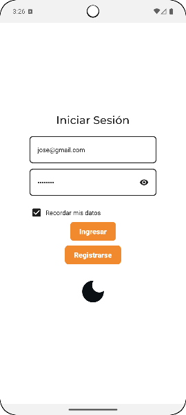
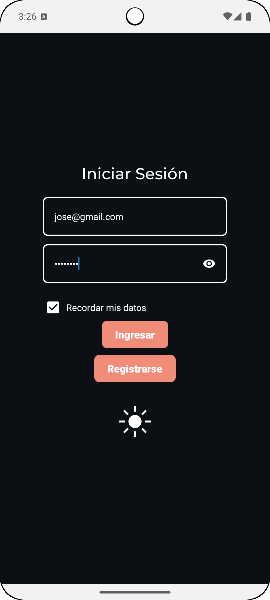
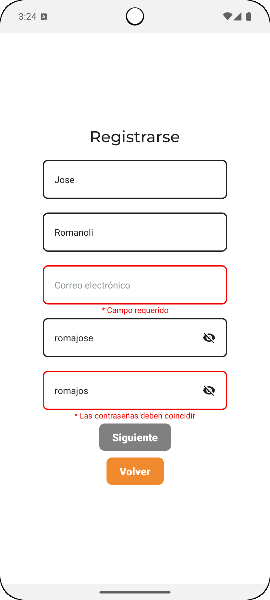
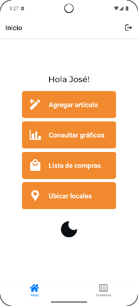
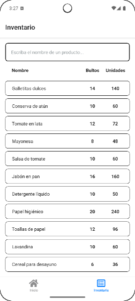

# Stocker


Stocker permitirá a vendedores organizar su inventario a la hora de la salida de productos con mayor rapidez, reemplazando la cuadernola de la vieja escuela y proporcionando más características útiles, facilitando su uso y haciéndolo dinámico para todos.


## 🚀 **Características**


- ✅ Registro e inicio de sesión con perfiles para control de permisos.

- ✅ Listar productos de manera sencilla, para agregarlos a tu inventario sin dificultades.

- ✅ Se utilizó React Native y Expo

- ✅ Soporte para \[iOS y Android]


## 📦 **Instalación**


```bash

# Clona el repositorio

git clone https://github.com/fbarsi/stocker


# Entra al directorio

cd stocker


# Instala las dependencias

npm install


🛠️ Uso

Dentro de la carpeta designada, escribir:


npx expo start


Luego, iniciar según el dispositivo a utilizar:

"› Press a open Android"

"› Press i open iOS"
```


## 📦 Estructura del Proyecto
```bash

stocker/

├── app/

│   ├── auth/                 # Rutas de autenticación (Stack Navigation)

│   ├── tabs/                 # Rutas principales (Tab Navigation)

│   └── root.tsx              # Componente raíz de la aplicación

├── assets/                   # Recursos gráficos

├── components/               # Componentes reutilizables de UI

├── shared/                   # Módulos compartidos (lógica, contextos, etc.)

├── utils/                    # Constantes generales (colores, estilos, etc.)

├── App.tsx                   # Punto de entrada principal de la app

├── index.ts                  # Inicialización de la app

└── tsconfig.json             # Configuración de TypeScript
```


## 🙋‍♂️ Autores


* Barsi, Franco Gabriel
* Romanoli, José Alberto
* Alvarez, Yamil
* Milesi, Agustín Exequiel
  

## 📄 Capturas de pantalla: Login


Permite iniciar sesión. Para hacerlo más cómodo a la vista del usuario incorporamos en un botón un cambio de tema para el resto de la aplicación, además de un checkbox para recordar los datos para futuros inicios de sesión. 

## 📄 Capturas de pantalla: Registro


Permite que el usuario se registre. El registro cuenta con validación de entrada de datos, para no incumplir con los formatos requeridos.

## 📄 Capturas de pantalla: Inicio


Ésta es la pantalla principal de la aplicación, con accesos directos a las funcionalidades. Además cuenta con un botón de deslogueo en caso de querer iniciar sesión con otras credenciales.

## 📄 Capturas de pantalla: Inventario


El Inventario nos va a permitir visualizar, buscar y editar una lista con los productos añadidos.


## 📄 Licencia

Este proyecto está bajo la licencia MIT. Consulta el archivo LICENSE para más detalles.